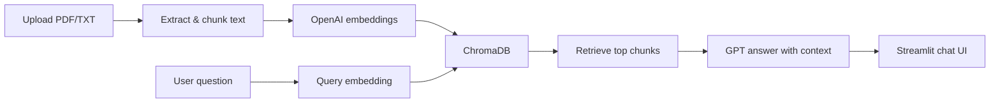

# Document Chatbot

A full-stack document Q&A app: upload PDF or TXT files, store them in a vector database, and chat with your documents using OpenAI and RAG (Retrieval-Augmented Generation).

| Layer | Stack |
|-------|--------|
| **Backend** | FastAPI, LangChain, ChromaDB, OpenAI |
| **Frontend** | Streamlit |

---

## Prerequisites

- Python 3.10+
- [OpenAI API key](https://platform.openai.com/api-keys)

---

## Project structure

```
The Intellify/
├── .env                 # Environment variables (create from .env.example)
├── .env.example         # Template for all env vars
├── requirements.txt     # Python dependencies (backend + frontend)
├── README.md
├── Backend/
│   └── app/
│       ├── main.py          # FastAPI entry point
│       ├── config.py
│       ├── api/             # Upload, query, documents routes
│       ├── services/        # RAG, embeddings, vector store
│       ├── utils/
│       └── storage/         # Uploads, Chroma DB, metadata (gitignored)
└── Frontend/
    ├── app.py               # Streamlit entry point
    ├── api_client.py        # Calls the backend API
    └── components/          # Upload, chat, document manager UI
```

---

## Environment setup

Both apps load variables from a `.env` file in the project root (via `python-dotenv`).

### 1. Create your `.env` file

From the project root:

```powershell
copy .env.example .env
```

### 2. Edit `.env`

Use `KEY=value` format with **no spaces** around `=`:

```env
# Required — used by the backend for embeddings and chat
OPENAI_API_KEY=sk-your-key-here

# Optional — used by the frontend to reach the API (default shown below)
BACKEND_URL=http://127.0.0.1:8000
```

| Variable | Required | Used by | Default | Description |
|----------|----------|---------|---------|-------------|
| `OPENAI_API_KEY` | **Yes** | Backend | — | OpenAI API key for `text-embedding-3-small` and `gpt-4o-mini` |
| `BACKEND_URL` | No | Frontend | `http://127.0.0.1:8000` | Base URL of the FastAPI server |

> **Note:** Never commit `.env` to git. It is listed in `.gitignore`. Only commit `.env.example`.

Model names and storage paths are configured in `Backend/app/config.py`.

---

## Installation

Run everything from the **project root**.

### 1. Create a virtual environment

```powershell
python -m venv env
.\env\Scripts\activate
```

### 2. Install dependencies

```powershell
pip install -r requirements.txt
```

### 3. Configure environment

Follow [Environment setup](#environment-setup) above.

---

## Running the application

You need **two terminals**, both with the virtual environment activated.

### Terminal 1 — Backend API

```powershell
cd Backend\app
uvicorn main:app --reload --host 0.0.0.0 --port 8000
```

| Resource | URL |
|----------|-----|
| API | http://127.0.0.1:8000 |
| Swagger docs | http://127.0.0.1:8000/docs |

Start uvicorn from `Backend\app` so paths like `storage/chroma_db` resolve correctly.

### Terminal 2 — Frontend UI

```powershell
cd Frontend
streamlit run app.py
```

Open http://localhost:8501 in your browser.

---

## Usage

1. Start the **backend** first, then the **frontend**.
2. **Upload** a PDF or TXT file in the left panel and click **Upload**.
3. **Manage** uploaded files in the document list (delete if needed).
4. **Chat** in the right panel — questions are answered using content from your uploaded documents.

---

## API reference

| Method | Path | Description |
|--------|------|-------------|
| `GET` | `/` | Health check |
| `POST` | `/upload-document` | Upload PDF or TXT (`multipart/form-data`, field: `file`) |
| `POST` | `/query` | Ask a question — body: `{ "question": "your question" }` |
| `GET` | `/documents` | List all uploaded documents |
| `DELETE` | `/documents/{document_id}` | Delete a document and its embeddings |

---

## How it works



1. **Upload** — Text is extracted, split into chunks, embedded, and stored in ChromaDB with metadata.
2. **Query** — The question is embedded, similar chunks are retrieved, and GPT generates an answer from that context.
3. **Delete** — Removes vectors from ChromaDB and the record from `storage/documents.json`.

---

## Troubleshooting

| Issue | Fix |
|-------|-----|
| `OPENAI_API_KEY` not found | Create `.env` at the project root from `.env.example`. Use `KEY=value` with no spaces. |
| Backend import errors | Run `uvicorn` from `Backend\app`, not from the project root or `Backend` alone. |
| Frontend connection errors | Ensure the backend is running and `BACKEND_URL` in `.env` matches the API address. |
| `streamlit` not recognized | Activate `env` or run `python -m streamlit run app.py` from `Frontend`. |
| Empty or generic answers | Upload at least one document before chatting. |

---

## More detail

- Backend-only notes: [Backend/README.md](Backend/README.md)
- Frontend-only notes: [Frontend/README.md](Frontend/README.md)
